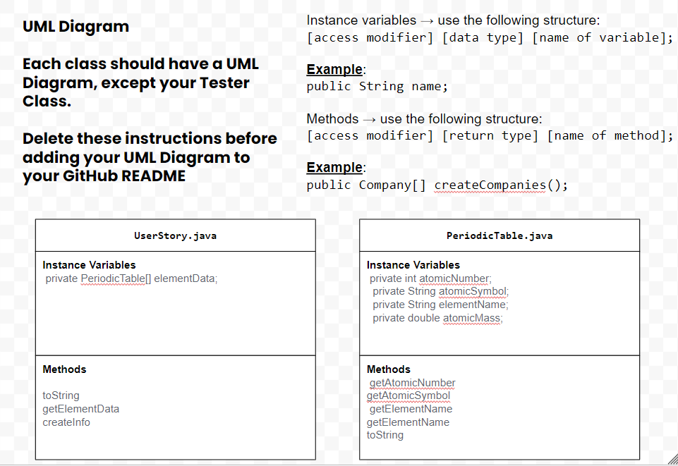

# Unit 3 - Data for Social Good Project 

## Introduction 

Software engineers develop programs to work with data and provide information to a user. Each user has different needs based on the information they are looking for from data. Your goal is to create a data analysis program for your user that stores and analyzes data to provide the information they need. 

## Requirements 

Use your knowledge of object-oriented programming, one-dimensional (1D) arrays, and algorithms to create your data analysis program: 
- **Write a class** – Write a class to represent your user or business and store and analyze their data with no-argument and parameterized constructors. 
- **Create at least two 1D arrays** – Create at least two 1D arrays to store the data that your user needs information about. 
- **Write a method** – Write a method that finds or manipulates the elements in a 1D array to provide the information your user needs. 
- **Implement a toString() method** – Write a toString() method that returns general information about the data (for example, number of values in the dataset). 
- **Document your code** – Use comments to explain the purpose of the methods and code segments and note any preconditions and postconditions. 

## User Story 

Include your User Story you analyzed for your project here. Your User Story should have the following format: 

> As chemistry students also taking a coding course, we want to have a meaningful impact within our school community by creating a software that utilizes computer science principles while also enabling students to succeed in their chemistry classes. Our software be an organized database of information of each element and will have a feature allowing students to search for specific information regarding specific elements.  

## Dataset 

Our dataset was directly from code.org. In a prior project I used a similar concept that incorporated elements of the periodic table. We recycled that dataset for this project. 

Dataset: https://studio.code.org/projects/applab/Jq9rpMWuhP6lk8BPn3ny9TG3CLu1Z-8NfSv963g83hc/edit 
- **Name** (String) - Name of the element 
- **Elemental Symbol** (int) - The elemental symbol that represents each element
- **Atomic Number** (double) - the number of protons in the nucleus of an atom, which determines the chemical properties of an element and its place in the periodic table.
- **Atomic Mass** (double) - the mass of an atom of a chemical element expressed in atomic mass units.

## UML Diagram 

Put and image of your UML Diagram here. Upload the image of your UML Diagram to your repository, then use the Markdown syntax to insert your image here. Make sure your image file name is one work, otherwise it might not properly get display on this README. 

## Description 

The goal of our project was to fuse aspects of chemistry and computer science to create an impactful software that can benefit students in their chemistry courses. The software acted similarly to an encyclopedia in that it listed the properties of all the elements sequentially. The feature which distinguishes it however is the ability to search for information regarding a specific element. This eliminates the tedious action of searching for information. This was accomplished by allowing for user input and storing that as a value to compare to the values of elements within the array. Our utilization of 1D arrays containing elements that have the given data for each of the categories above allows for an optimized program. Additionally the implementation of the scanner allows for easily accessible information found within the arrays.